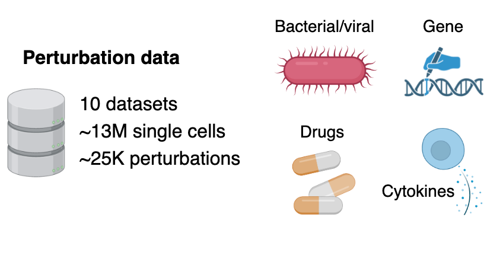
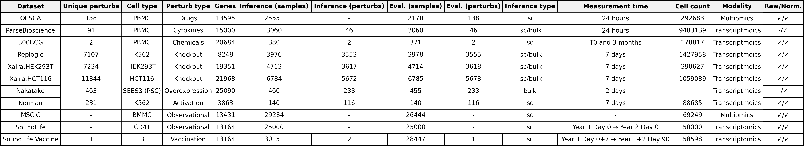

Datasets
========
The list of datasets integrated into geneRNIB is provided below:

----

----

The table above summarizes the key properties of each dataset. **Inference (samples)** and **Eval. (samples)** refer to the number of samples used for GRN inference and evaluation, respectively. **Inference (perturbs)** and **Eval. (perturbs)** indicate the number of unique perturbations in each split. The **Raw/Norm.** column indicates data availability: **Raw** refers to raw integer count, while **Norm.** refers to expression values (``lognorm`` or ``xnorm`` layer). Most datasets provide both; the raw counts enable alternative normalization strategies.

Note that for the **ParseBioscience** dataset, the raw single-cell count data is available in the ``resources/extended_data/`` folder (``parsebioscience_train_sc.h5ad``; ~4.96M cells × 15,000 genes, 19 GB) but is not included in the main ``resources/grn_benchmark/`` folder due to its large file size. 

----

You need `awscli` to download the datasets. 

.. code-block:: bash
   pip install awscli

Downloading the main datasets
---------------------------------------------

.. code-block:: bash

   aws s3 sync s3://openproblems-data/resources/grn/grn_benchmark resources/grn_benchmark/ --no-sign-request

This command downloads the data to `resources/grn_benchmark/`, which is the default directory for geneRNIB for further GRN inference and evaluation.

Additionally, you will find the `resources/grn_benchmark/prior/` folder, which contains supplementary files such as the list of known TFs. 
Files containing `consensus` tags are used in the evaluation metrics to standardize comparisons.

Downloading the extended datasets
-----------------------------

Beyond the core datasets, extended datasets include single cell data of large perturbation datasets such as Replogle, Xaira, and Parse bioscience.
The previous version were pseudobulked for computational efficiency. 
Additionally, full pseudobulked versions of all other datasets are available, representing the combined inference and evaluation datasets. 
These files are used for the `positive control` method, which incorporates all variations within a dataset.

To download the extended datasets, use:

.. code-block:: bash

   aws s3 sync s3://openproblems-data/resources/grn/extended_data/ resources/extended_data/ --no-sign-request

Downloading the raw/unprocessed data
--------------------------------

All previously mentioned datasets are processed versions. To access the raw, unprocessed data, run:

.. code-block:: bash

   aws s3 sync s3://openproblems-data/resources/grn/datasets_raw/ resources/datasets_raw/ --no-sign-request

We have not provided raw data for a few recent datasets due to very large file sizes. Pls contact us if you need the raw data for these datasets.

Downloading the results
---------------------------------------------
To download the results of geneRNIB (needed for the leaderboard and the paper):

.. code-block:: bash

   aws s3 sync s3://openproblems-data/resources/grn/results resources/results/ --no-sign-request
