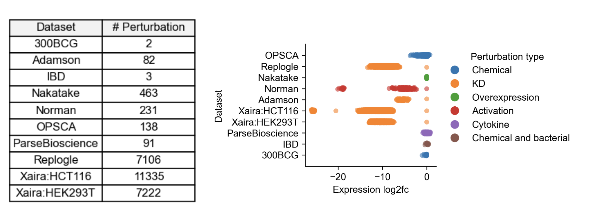

Datasets
========
In this section, we explain how to access datasets without installing geneRNIB.  The available datasets include **OPSCA, Nakatake, Replogle, Adamson,** and **Norman**. Each dataset provides RNA data, while the `OPSCA` dataset also includes ATAC data. The perturbation signature of these datasets are given below. 
You need `awscli` to download the datasets. If you don't have it installed, you can download it from [here](https://aws.amazon.com/cli/). You do not need to sign in to download the datasets.

----

Downloading the test datasets
---------------------------------------------

.. code-block:: bash

   aws s3 sync s3://openproblems-data/resources_test/grn resources_test/--no-sign-request

This command downloads the data to `resources_test/`. The content of this folder is needed for testing component integration.

Downloading the main datasets
---------------------------------------------

.. code-block:: bash

   aws s3 sync s3://openproblems-data/resources/grn/grn_benchmark resources/grn_benchmark/ --no-sign-request

This command downloads the data to `resources/grn_benchmark/`, which is the default directory for geneRNIB for further GRN inference and evaluation.

Additionally, you will find the `resources/grn_benchmark/prior/` folder, which contains supplementary files such as the list of known transcription factors (TFs). This list is used for GRN inference (causal TF-gene masking) and in the evaluation metrics to include only edges where the source gene is among these TFs. Additional files in this folder, such as those with `consensus` tags, are used in the evaluation metrics to standardize permitted edges per different metric.

Downloading the extended datasets
-----------------------------

Beyond the core datasets, extended datasets include the Replogle dataset in single-cell format (`replogle_train_sc.h5ad`). The previous version was pseudobulked for computational efficiency. Additionally, pseudobulked versions of all other datasets are available, representing the combined inference and evaluation datasets. These files are used for the `positive control` method, which incorporates all variations within a dataset.

To download the extended datasets, use:

.. code-block:: bash

   aws s3 sync s3://openproblems-data/resources/grn/extended_data/ resources/extended_data/ --no-sign-request

Downloading the raw/unprocessed data
--------------------------------

All previously mentioned datasets are processed versions. To access the raw, unprocessed data, run:

.. code-block:: bash

   aws s3 sync s3://openproblems-data/resources/grn/datasets_raw/ resources/datasets_raw/ --no-sign-request

Downloading the GRN models
---------------------------------------------
To download the GRN models used in geneRNIB so far, run:

.. code-block:: bash

   aws s3 sync s3://openproblems-data/resources/grn/grn_models resources/grn_models/ --no-sign-request

Downloading the results
---------------------------------------------
To download the results of geneRNIB (needed for the leaderboard and the paper):

.. code-block:: bash

   aws s3 sync s3://openproblems-data/resources/grn/results resources/results/ --no-sign-request
