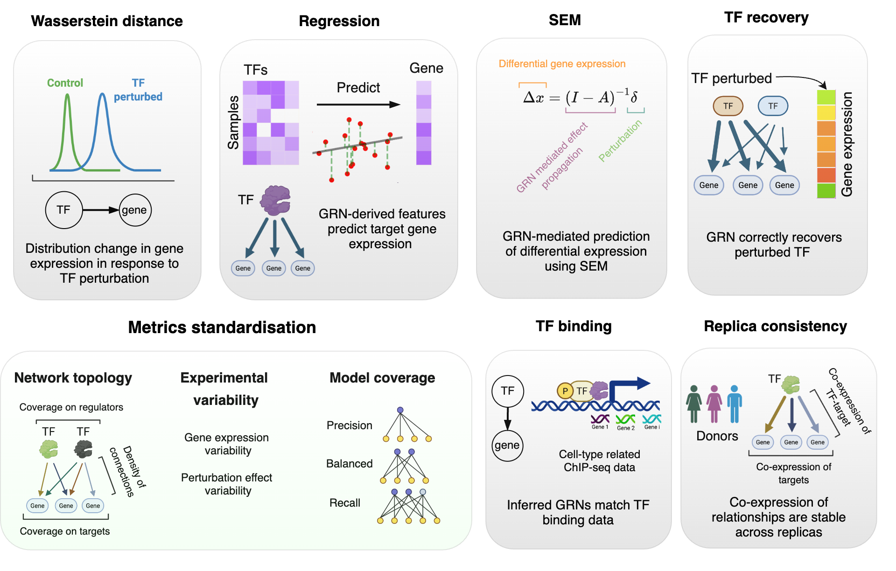

GRN evaluation
=================
The evaluation metrics used in geneRNIB are summarized below. 

  

----

.. image:: images/datasets_metrics.png
   :width: 90%
   :align: center
----


For a detailed description of each metric, refer to the geneRNIB paper.

The evaluation metrics expect the inferred network to be in the form of an AnnData object with specific format as explained here. 
It should be noted that the metric currently evaluate only the **top TF-gene pairs**, currently limited to **50,000 edges**, ranked by their assigned weight.  

The inferred network should have a tabular format with the following columns:  

  - `source`: TF gene name
  - `target`: Target gene gene  
  - `weight`: Regulatory importance/likelihood score/etc.  

See `resources/grn_benchmark/prior/collectri.h5ad` for an example of the expected format.

Running GRN evaluation using standard pipeline
----------------------------------------

To run the evalution for a given GRN and dataset, use the following command:

```bash
bash scripts/run_grn_evaluation.sh --prediction=<inferred GRN (e.g.collectri.h5ad)> --save_dir=<e.g.output/> --dataset=<e.g. replogle> --build_images=<true or false. true for the first time running> 
```

example command:

```bash
bash scripts/run_grn_evaluation.sh --prediction=resources/grn_models/op/collectri.h5ad --save_dir=output/ --dataset=op --build_images=true 
```


Running GRN evaluation without docker
----------------------------------------
Considering that Docker is not supported by certtain systems, you can run the evaluation without Docker by following these steps:

```bash
bash src/metrics/all_metrics/run_local.sh --dataset <dataset_name> --prediction=<inferred GRN (e.g.collectri.h5ad)> --score <output_score_file.h5ad> --num_workers <number_of_workers>
```

example command:

```bash
bash src/metrics/all_metrics/run_local.sh --dataset op --prediction=resources/grn_models/op/collectri.h5ad --score=output_score_file.h5ad --num_workers=20
```