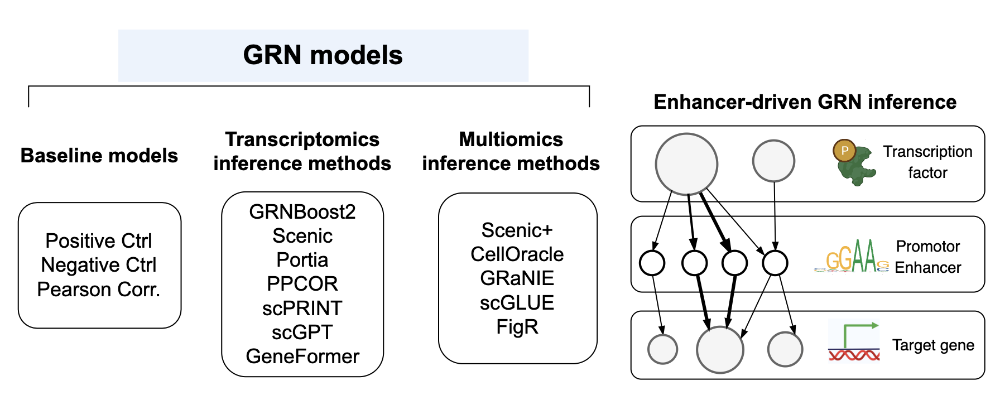

Documentation for Gene Regulatory Network Inference Benchmark (geneRNIB)
========================================================================

geneRNIB is a living benchmark platform for GRN inference. This platform provides curated datasets for GRN inference and evaluation, standardized evaluation protocols and metrics, computational infrastructure, and a dynamically updated leaderboard to track state-of-the-art methods. It runs novel GRNs in the cloud, offers competition scores, and stores them for future comparisons, reflecting new developments over time.

The platform supports the integration of new inference methods, datasets, and protocols. When a new feature is added, previously evaluated GRNs are re-assessed, and the leaderboard is updated accordingly. The aim is to evaluate both the accuracy and completeness of inferred GRNs. It is designed for both single-modality and multi-omics GRN inference.

.. image:: images/overview.png
   :width: 70%
   :align: center
----

This documentation is supplementary to the paper `geneRNIB: a living benchmark for gene regulatory network inference <add a link here>`_ and the `GitHub page <https://github.com/openproblems-bio/task_grn_inference>`_ on the OpenProblems platform. 

To install geneRNIB, see the `GitHub page <https://github.com/openproblems-bio/task_grn_inference>`_.
 
For instructions on how to download and access datasets, refer to the :doc:`dataset` section.

For information on evaluation metrics, refer to the :doc:`evaluation` section.

To integrate your GRN inference method, metric, or dataset, follow the instructions in the :doc:`extending` section. 

To see the comparitive performance of the integrated GRN inference methods, refer to the :doc:`leaderboard` section.

----

Pls see the GitHub page for the list of currently integrated methods. The methods are implemented in Python and R, and they can be used to infer GRNs from the datasets provided by geneRNIB.

In addition, three baseline methods are integrated into geneRNIB. These methods are used to evaluate the performance of new methods. The baseline methods are:

- **Negative control**: Randomly assigns weights to edges. GRN inference methods should outperform this method.
- **Pearson correlation**: Assigns weights based on the Pearson correlation between genes.
- **Positive control**: Similar to Pearson correlation with the exception that it uses both inference and evaluation dataset to infer the GRN. This method is expected to outperform most methods.

.. .. list-table:: Authors & contributors
..    :widths: 25 25
..    :header-rows: 1

..    * - name
..      - roles
..    * - Jalil Nourisa
..      - author
..    * - Antoine Passemiers
..      - author
..    * - Robrecht Cannoodt
..      - author
..    * - Marco Stock
..      - author

Contents
--------

.. toctree::

   dataset
   evaluation
   extending
   leaderboard
  
   