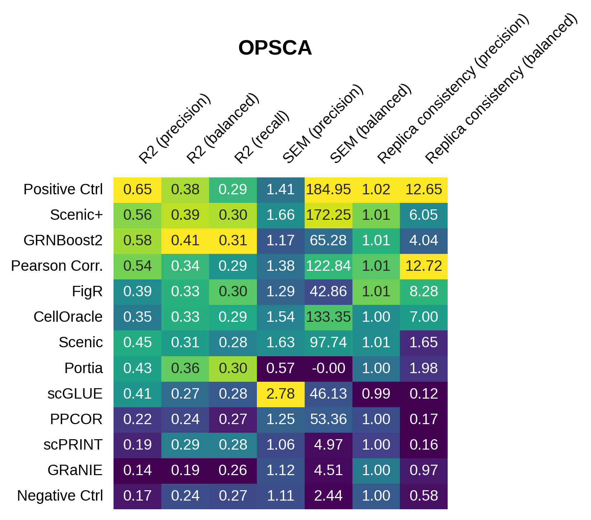
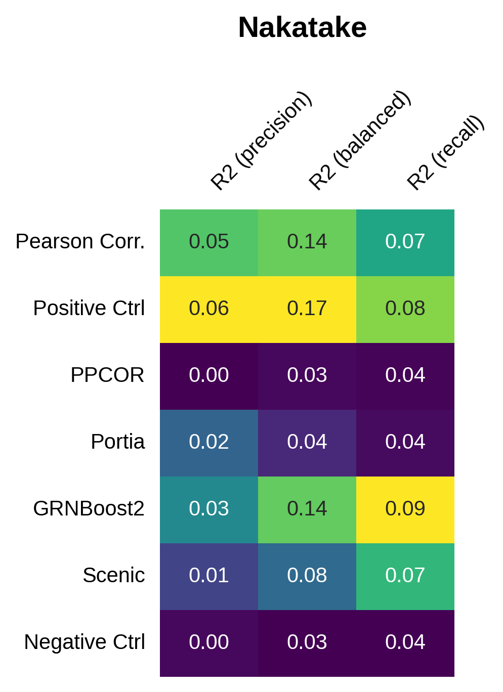
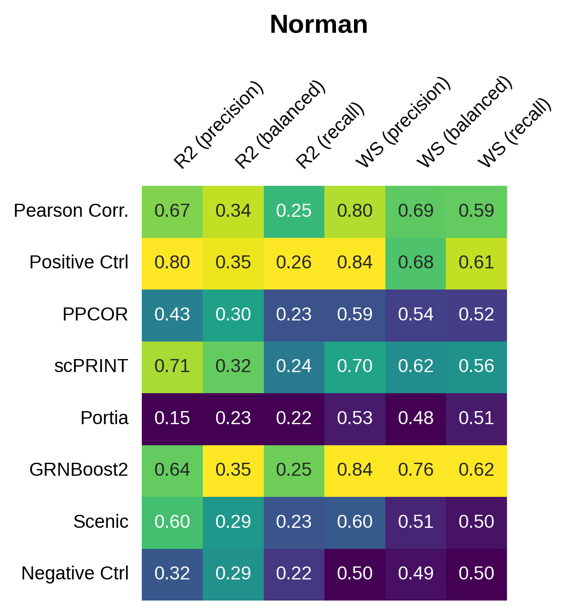
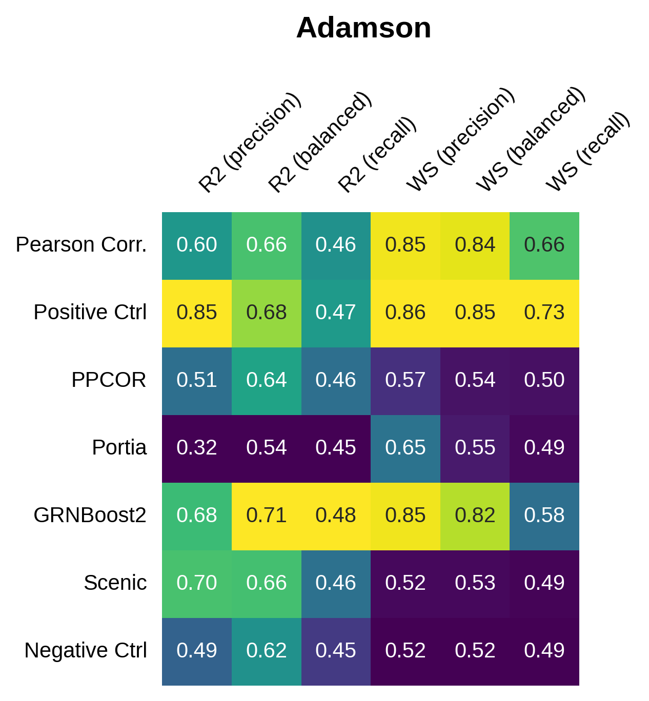
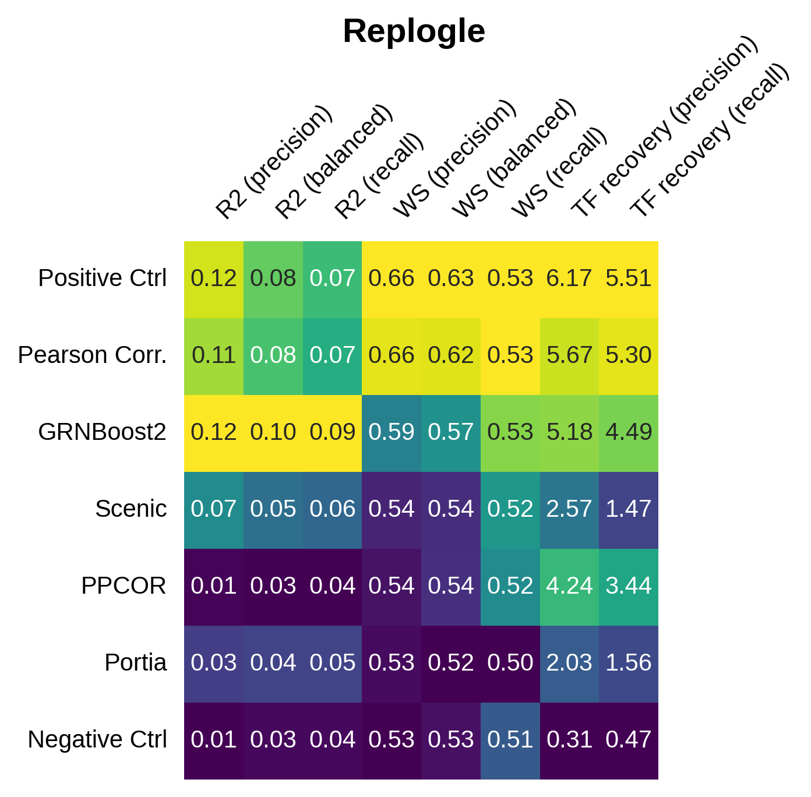
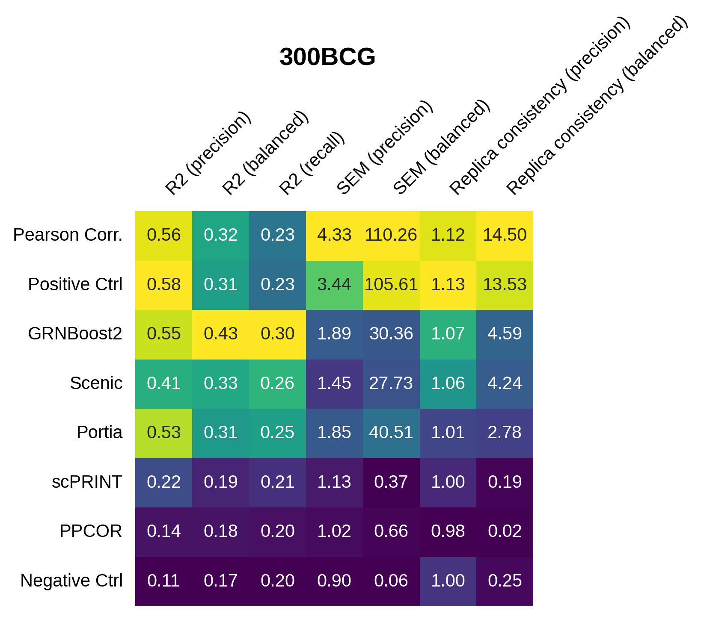
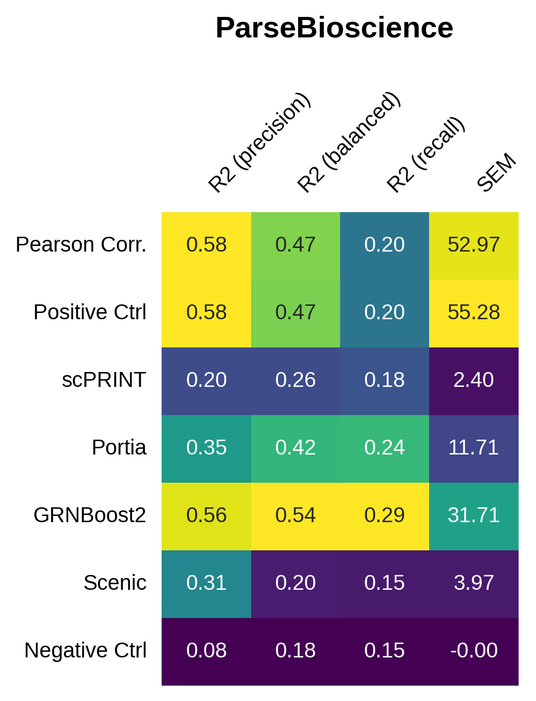
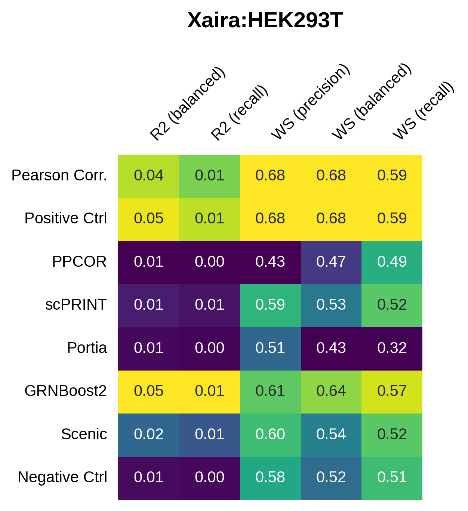
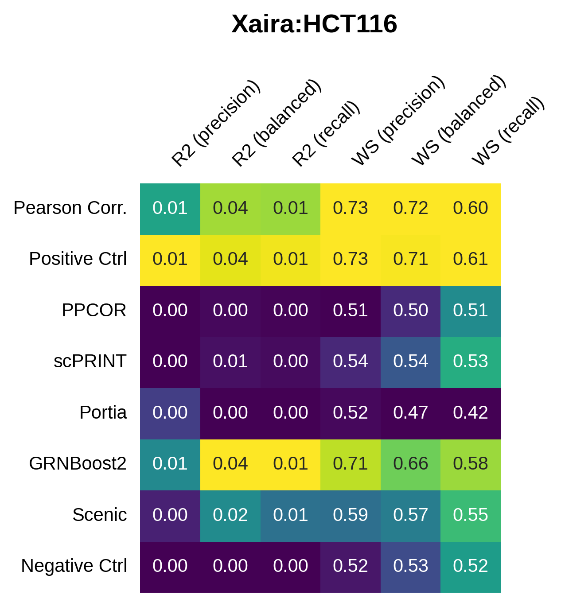

Leaderboard
=================
.. The overal comparitive performance of the integrated GRN inference methods is summarized in the leaderboard below. 
  
.. .. image:: images/leaderboard.png
..    :width: 90%
..    :align: center
.. ----

The individual performance of the methods on each dataset is summarized below.

----

----

----

----

----

----

----

----

----

----