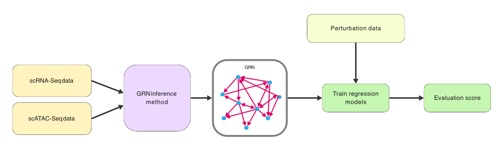

Overview
========

The pipeline evaluates inferred GRNs against perturbation data. The evaluation is done by training two types of regression models. 
This type of evaluation is closer to evaluating the biological knowledge that a GRN should represent, instead of evaluating the presence of edges in a statistical way only, as commonly done by using metrics, such as AUPRC or AUROC. 
The general setup is shown in the figure below:

The pipeline can evaluate algorithms that leverage only one of the multi-omic data types (RNA-Seq or ATAC-Seq) or both.
It also evaluates the performance of two controls:

#. As a *negative control*, the pipeline evaluates the performance of a random network.
#. As a *positive control*, the pipeline evaluates the performance of a network derived from correlation of genes in the perturbation dataset used for evaluation.

The two types of regression models are:

#. Regression from GRN regulations to target expression
#. Regression from TF expression of predicted regulators to target expression

More details can be found in section :doc:`evaluation`.

In the future, other prior knowledge can be incorporated in the pipeline to allow for evaluation with binary classification metrics and as an additional control method. 

